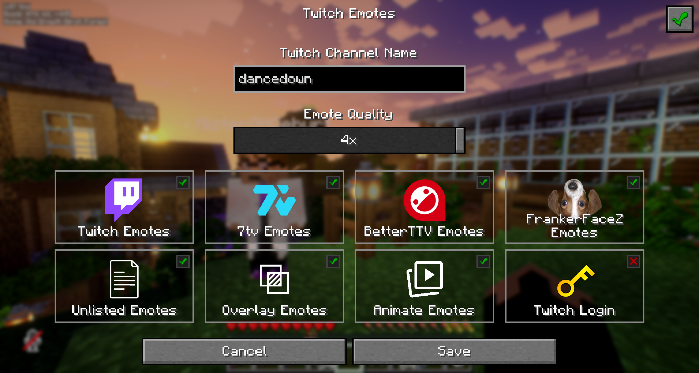

# Twitch Emotes

A mod for rendering Twitch, BetterTTV, FrankerFaceZ and 7tv emotes in the Minecraft chat.\
This mod is client-sided and runs on Minecraft 1.21.11 and Fabric only.

---

## Features

- Inline emotes in regular chat messages
- Tab-completion for emote names
- Compatible with other mods
- Customizable channel
- Animated emotes
- Overlay emotes
- Client-side only
- No login required

---

## Screenshots

*Chat Heads and timestamps are <b>not</b> included in this mod!*

---

## Dependencies and APIs

This mod uses:

- [**Fabric API**](https://github.com/FabricMC/fabric-api)
- [**WebPDecoderJN**](https://github.com/tduva/WebPDecoderJN) by tduva (for animated WebP decoding)
- [**Twitch API**](https://dev.twitch.tv/docs/api/) (for retrieving twitch emotes directly from twitch)
- [**Scalar API**](https://api.ivr.fi/v2/docs) (for retrieving Twitch emotes without requiring user authorization)
- [**7tv API**](https://7tv.io/v3/docs) (for retrieving 7tv emotes)
- [**BetterTTV API**](https://betterttv.com/developers/api) (for retrieving BTTV emotes)
- [**FrankerFaceZ API** (v1)](https://api.frankerfacez.com/docs) (for retrieving FFZ emotes)

All external libraries are used solely for emote retrieval and decoding.

---

## Installation

1. Install Fabric Loader for Minecraft 1.21.11 (version `0.18.4`)
2. Install Fabric API (version `0.141.3`)
3. Place the mod `.jar` file into your `mods` folder
4. Launch the game

---

## Inspiration

I've been playing on a Minecraft server with friends I made on Twitch, and we're used to using Twitch emotes.\
When the server was still on version `1.21` I found the TwitchEmotes mod by falu on GitHub,
updated it to the version we were playing on, added a few features and recommended it to others.

Unfortunately, when the server was upgraded to version `1.21.11`, the mod didn't work anymore and I couldn't
figure out how to keep the architecture of this mod in modern Minecraft. So I started coding my own version
of the mod from scratch.

In contrast to falu's mod, it doesn't have twitch chat integration as the main goal of this mod is
just to show emotes in chat, but such features may be included in the future.

---

## Contributions are welcome!

For more details, [have a look in the contribution file](CONTRIBUTING.md)!

### Contributors
- DanceDown (author of this mod)

---

## License

Licensed under the MIT License. See [LICENSE](LICENSE) for details.

This project includes `WebPDecoderJN` by tduva, licensed under the BSD 3-Clause License.
See [COPYING](webpdecoderjn/COPYING) for details.

The native WebP libraries are based on libwebp by Google Inc.